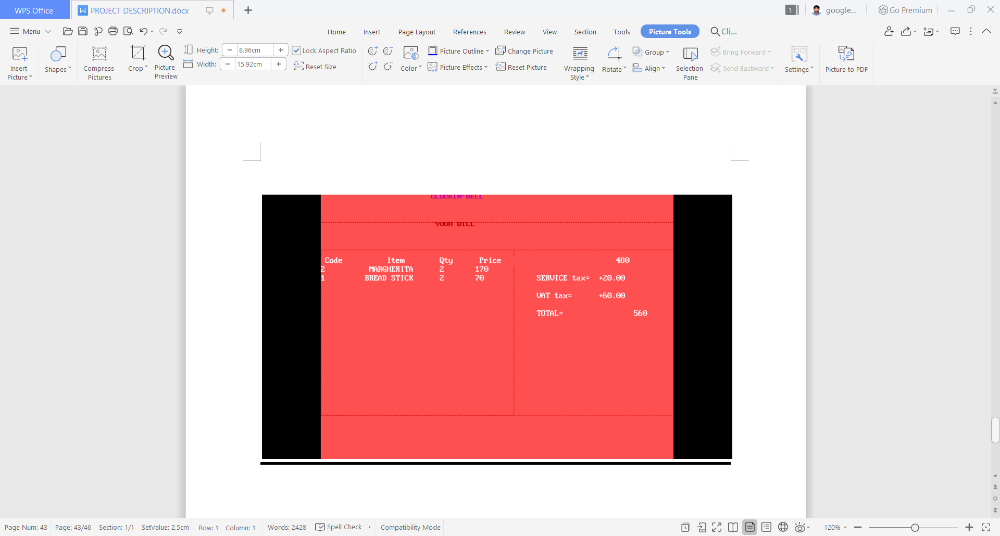

# Pizza_Reservation_C++

This project is done while I'm studying higher secondary. As title says, it is Pizza Reservation Program fully done at C++.
One of the main feature in this is ,it is heavily built with colors,rectangles,squares etc.. by including the header file
**graphics.h**. 

# Features of this Project
1. Heavily used with **graphics.h**
2. You can add the items as admin side and fix its price too.
3. You can buy the items added by admin as customer.
4. To change the UI of the program from cutomer side to order to billing, the **keyboard buttons(up,bottom,right,left) act as navigator** .

# Behind-The-Scenes(Main Concepts)
1. File operations have been done.
2. Class objects and functions is used.

# Result of the program looks like this:

